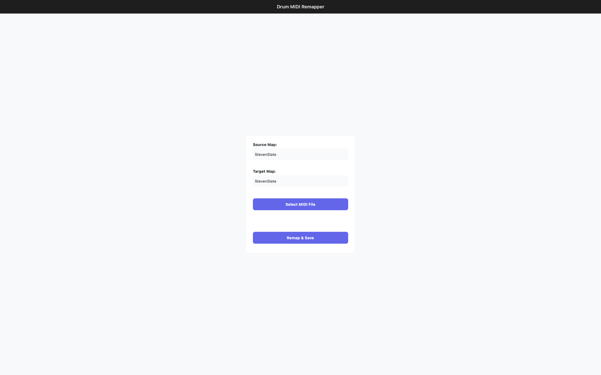

# Drum MIDI Remapper

A cross-platform tool built with **.NET 8** for remapping MIDI drum notes between different standards and custom mappings. Designed for musicians and producers to adapt MIDI drum tracks for compatibility with various drum kits, DAWs, and hardware.

Includes both a CLI and a .NET MAUI GUI for easy drum MIDI remapping.


---

## Features

- Remap MIDI drum notes using customizable JSON mapping files
- Supports popular drum mapping standards (GuitarPro, StevenSlate, LogicPro, ProTools)
- Batch processing of MIDI files via CLI
- Modular architecture with Dependency Injection for extensibility
- .NET MAUI cross-platform GUI with drag-and-drop interface
- Export remapped MIDI files directly from the GUI
- Compatible with Windows and macOS via MAUI
- CLI supports Windows, macOS, and Linux
- Powered by .NET 8

---

## Requirements

- [.NET 8.0 SDK](https://dotnet.microsoft.com/download)
- Windows, macOS, and Linux (CLI only)

---

## Download

Pre-built binaries are available for Windows and macOS from the [Releases](https://github.com/Abstractize/drum-midi-remapper/releases) page.

- **Windows:** Download the `.zip` file containing the `.msix` installer, extract it, and double-click the `.msix` to install.
- **macOS:** Download the `.dmg` file, open it, and drag the app to your Applications folder.

No installation required on Windows other than running the installer. See the release notes for details.

---

## Quick Start

### CLI (Cross-platform)

```bash
git clone https://github.com/Abstractize/drum-midi-remapper.git
cd drum-midi-remapper
dotnet build
dotnet run --project src/CLI -- GuitarPro StevenSlate midis/test.mid
```

### Windows (.NET MAUI GUI)

```powershell
dotnet build -f net8.0-windows10.0.19041.0
dotnet run --project src/GUI -f net8.0-windows10.0.19041.0
```

### macOS (.NET MAUI GUI)

```bash
dotnet build -f net8.0-maccatalyst
dotnet run --project src/GUI -f net8.0-maccatalyst
```

Replace `GuitarPro`, `StevenSlate`, and `midis/test.mid` with your desired mappings and MIDI file.

---

## CLI Usage

Run the tool with:

```bash
dotnet run --project src/CLI -- <SourceMap> <TargetMap> <InputMidiFile>
```

- `<SourceMap>` and `<TargetMap>`: Mapping names (see **Available Mappings** below)
- `<InputMidiFile>`: Path to the MIDI file to remap

The `--project src/CLI` option specifies the CLI project.

---

## Available Mappings

Mappings are stored as JSON files in the **Services/Resources/Maps/** directory. Specify the mapping name as a command-line argument when running the tool.

Included mappings:

- GuitarPro
- LogicPro
- ProTools
- StevenSlate

You can also create custom mappings by adding JSON files to the directory.

Feel free to add a new mapping by creating a JSON resource file and submitting a pull request.

---

## Configuration

Mapping files are JSON documents located in **Services/Resources/Maps/**. Edit or add files to customize drum note mappings.

### Example Mapping File (`ExampleMap.json`)

```json
{
    "name": "ExampleMap",
    "mapping": {
        "Kick": 36,
        "Snare": 38,
        "HiHatClosed": 42,
        "HiHatOpen": 46,
        "TomLow": 41,
        "TomMid": 45,
        "TomHigh": 48,
        "Crash": 49,
        "Ride": 51
    }
}
```

- `"name"`: Identifier for the map
- Values correspond to MIDI note numbers

> **Note:** MIDI note numbers follow the [General MIDI Percussion Key Map](https://www.midi.org/specifications-old/item/gm-level-1-sound-set). This project uses [DryWetMIDI](https://melanchall.github.io/drywetmidi/) for MIDI handling.

---

## Example

**Input:** MIDI file mapped for GuitarPro  
**Command:**

```bash
dotnet run --project src/CLI -- GuitarPro StevenSlate midis/test.mid
```

**Output:** MIDI file remapped for StevenSlate drums, saved in the current working directory.

---

## Screenshot



The screenshot shows the Drum MIDI Remapper application's main form. Users can upload a MIDI file and select both the source and target drum mapping standards from dropdown menus. The interface provides an intuitive workflow for remapping drum notes, with clear options for file selection and mapping configuration.

---

## Troubleshooting & FAQ

- **Build errors:** Ensure .NET 8 SDK is installed and your environment is configured correctly.
- **Mapping not found:** Verify spelling and that JSON mapping files exist in **Services/Resources/Maps/**.
- **MIDI file issues:** Confirm your input file is a valid MIDI file and accessible.

---

## Contributing

Contributions are welcome! Please open issues or submit pull requests.

### Adding a New Mapping

1. Add a JSON mapping file to **Services/Resources/Maps/**
2. Follow the existing file format for your mapping
3. Update the `DrumMapType` enum in `Models/DrumMapType.cs` to include your new map
4. Submit a pull request

---

## Related Projects

- [DryWetMIDI](https://melanchall.github.io/drywetmidi/) — MIDI processing library used by this tool

---

## License

MIT License

